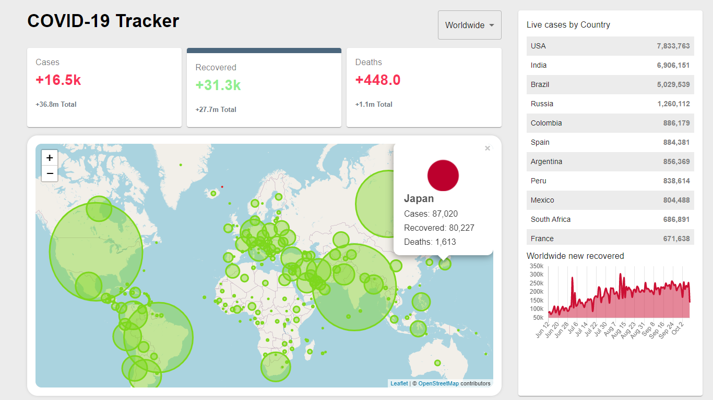

## COVID-19 TRACKER V2

This is a fully functional website that was developed using the React framework. This website is capable of displaying various data regarding covid-19 pandemic such as total cases, total recovered, and deaths. Additionally, it is also equiped with dynamic map, graph, and tables which would better visualize the data coming from the API. 

### Info
I was able to request the data from [Disease.sh](http://disease.sh/) 

